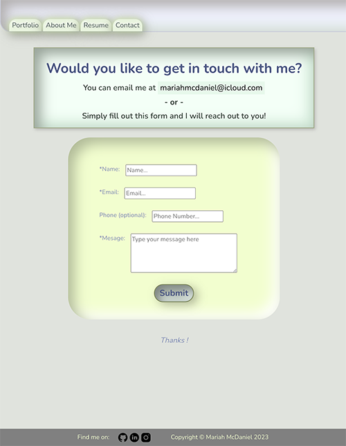

# professional-portfolio

## Description

I created this portfolio in order to share some of my projects and information about me. It was built using ExpressJS and React and deployed to Heroku. To view my portfolio website go to [https://www.mariahmcdaniel.com](https://www.mariahmcdaniel.com). 

## TABLE OF CONTENTS
- [Description](#description)
- [Usage](#usage)
- [Visuals](#visuals)
- [Contact](#contact)

## Usage

This website serves as my personal portfolio, it can be used to learn more about me, to discover some of the applications that I have built, and to connect with me easily via a simple contact form.

## Visuals

Animated landing page

Projects Page

Contact Form

## Contact

If you have any questions or you would like to connect with me, you can contact me via email [mariahmcdaniel@icloud.com](mariahmcdaniel@icloud.com) or fill out the form found on the contact page of my portfolio so that I can reach out to you.

[LinkedIn](https://www.linkedin.com/in/mariah-mcd/) - [https://www.linkedin.com/in/mariah-mcd/](https://www.linkedin.com/in/mariah-mcd/)